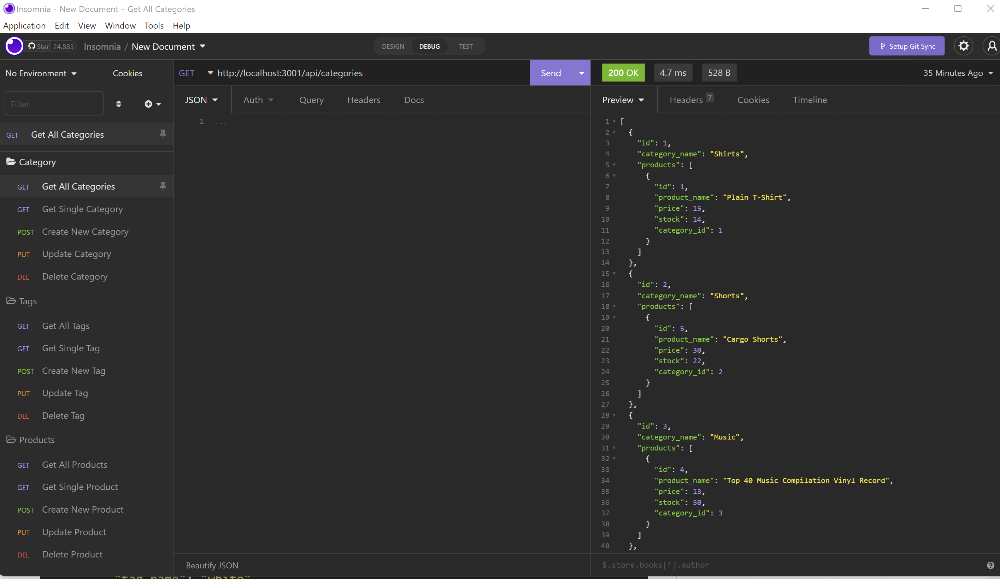

<h1>Object-Relational Mapping(ORM): E-Commerce Back End</h1>

<h3>Description</h3>
This application is a backend service for an e-commerce site that involves the use of an express.js server and SQL database. It includes RESTful APIs which handle CRUD operations for organizing products, categories and tags.
  
 
<h3>Installation</h3>
<ul>
  <li>Clone this repository</li>
  <li>Naviagate to the cloned repository on your directory.
  <li>Run npm install to install node.js.</li>
  <li>Include your user's MYSQL user and password information in the .env file.</li>
  <li>To connect to the database, run the following commands:
-mysql -u root -p
-Type in the user's MYSQL password
-source db/schema.sql;
-npm run seed</li>  
  <li>Run npm start to run the app and start the server. The user can then navigate to the port displayed in the terminal or use Insomnia.
  </li>
</ul>

 
<h3>Usage</h3>
<ul>
  <li>When the user adds the database name, MySQL username, and MySQL password to an environment variable file, then they will be able to connect to a database using Sequelize.</li>
  <li>When the user enters schema and seed commands, a development database is created and is seeded with test data.</li>
  <li>When the user enters the command to invoke the application, then the server is started and the Sequelize models are synced to the MySQL database.</li>
  <li>When the user opens API GET routes in Insomnia for categories, products, or tags, the data for each of these routes is displayed in a formatted JSON.</li>
  <li>When the user tests API POST, PUT, and DELETE routes in Insomnia, they are able to successfully create, update, and delete data in their database.</li>
</ul>

 
<h3>Links</h3>
  <ul>
    <li>Walkthrough Video: https://drive.google.com/drive/folders/1Rp_GRTSu81jsjfT3v_JAzkE27qCIPLD4</li>
    <li>GitHub Repo: git@github.com:JennyBloemen/Ecommerce.git</li>
  </ul>

 
<h3>Mock-Up</h3>
<!-- video -->

 
<h3>Sources</h3>
<ul>
  <li>Node</li>
  <li>Express.js API</li>
  <li>MySQL</li>
  <li>Sequelize</li>  
</ul>
